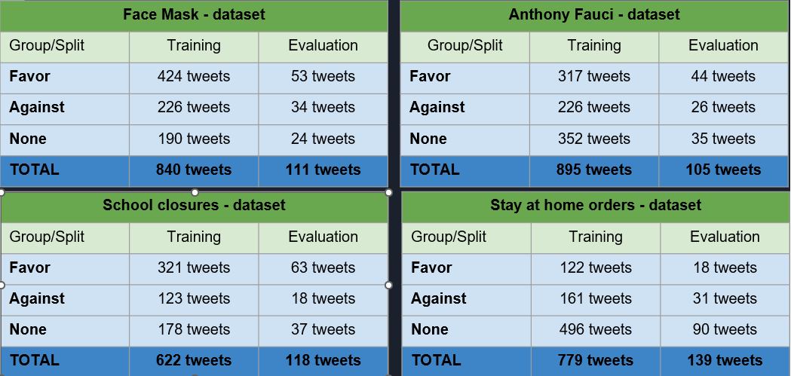
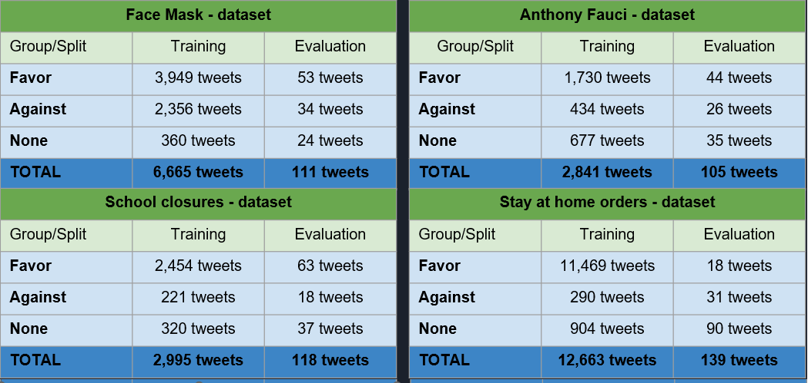

# Dataset Source and Hydration

The datasets were obtained from the following source: https://github.com/kglandt/stance-detection-in-covid-19-tweets/tree/main/dataset

There are four datasets (stance with a specific topic related to health mandates):
- Face maks
- Anthony Fauci
- Stay at home orders
- School closures

Training and validation set were already manually labeled, whereas the noisy set were automatically labeled (also called as silver standard dataset). Two approaches were implemented, in which the first approach the silver standard dataset was exclused from the training set. And in the second approach the silver standard dataset was included for the training set.

## Dataset statistics (without silver standard/noisy dataset)

## Dataset statistics (with silver standard/noisy dataset)

