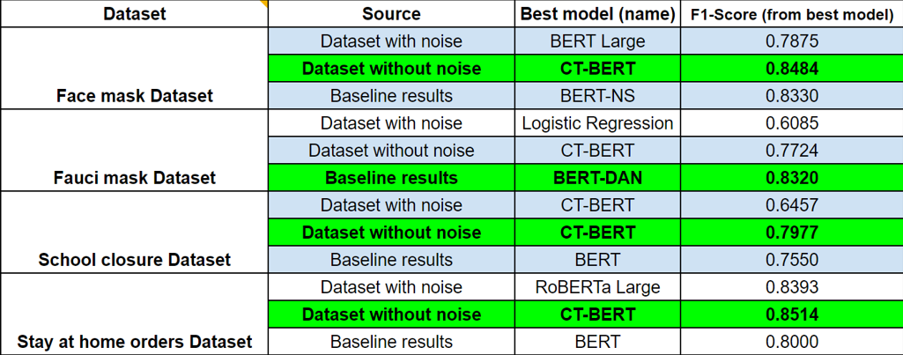

# RESULTS

In this folder, you will find the results from all the trained/fine-tuned models across all the experiments implemented using different approaches on the datasets explained in the dataset folder. These results generated are:

- Confusion matrix (normalized confusion matrix)
- Prediction list (CSV file)
- Classification report (Accuracy, macro-avg F1-Score, Precision, and Recall)

In the following table, we are showing the comparison (in terms of macro F1-score) between the baseline results, and our two approaches (dataset with and without noise), in which the baselines results were beaten in 3 out of 4 datasets.

